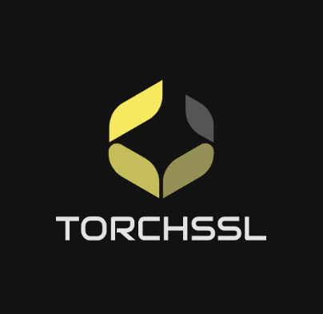

# TorchSSL

All required packages can be installed with `environment.yml`

To reproduce results on standard benchmark, for example, balanced CIFAR10 with 40 total labels:

`python energymatch.py --world-size 1 --rank 0 --c config/energymatch/energymatch_cifar10_40_0.yaml`

To reproduce results on long-tailed benchmark, for example, CIFAR10-LT with 10% labeled data and imbalance ratio 100:

`python energymatch.py --world-size 1 --rank 0 --c config/energymatch/energymatch_cifar10_lt_10_100_0.yaml`